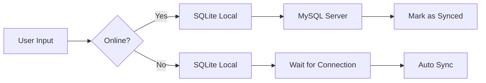

# SQLite Hybrid Database - คู่มือการใช้งาน

## ภาพรวม

แอพ Smart Farm ตอนนี้รองรับ **2 ฐานข้อมูล** พร้อมกัน:

| ฐานข้อมูล | ใช้เมื่อ | ที่เก็บ |
|-----------|---------|--------|
| **MySQL** | ออนไลน์ | Server (Cloud/Local) |
| **SQLite** | ออฟไลน์ | ในเครื่อง (Device) |

## การทำงาน

### 🌐 ออนไลน์ (มีอินเทอร์เน็ต)
```
แอพ → MySQL Server
       ↓
    อ่าน/เขียนข้อมูลโดยตรง
```

### 📴 ออฟไลน์ (ไม่มีอินเทอร์เน็ต)
```
แอพ → SQLite (Local)
       ↓
    ใช้ข้อมูลที่เก็บไว้ในเครื่อง
```

### 🔄 Auto-Sync
```
ออฟไลน์ → บันทึกใน SQLite → ออนไลน์ → Sync ไป MySQL
```

## คุณสมบัติหลัก

### [OK] 1. Automatic Mode Switching
แอพจะตรวจจับสถานะการเชื่อมต่ออัตโนมัติ:

```dart
// ไม่ต้องทำอะไร - แอพเปลี่ยนเอง!
if (online) {
  ใช้ MySQL  // ข้อมูลจาก Server
} else {
  ใช้ SQLite // ข้อมูลจากเครื่อง
}
```

### [OK] 2. Full CRUD Operations

**ทั้ง MySQL และ SQLite รองรับ:**
- [OK] **CREATE** - สร้างโรงเรือน, บันทึก sensor logs, device actions
- [OK] **READ** - อ่านข้อมูลโรงเรือน, สภาพแวดล้อม, สถานะอุปกรณ์
- [OK] **UPDATE** - แก้ไขโรงเรือน, อัพเดตประ๏คำอุปกรณ์
- [OK] **DELETE** - ลบโรงเรือน

### [OK] 3. Background Sync

**Sync ทุก 30 วินาที:**
```
[SQLite] → 🔄 → [MySQL]
```

**Sync เมื่อกลับมามีเน็ต:**
```
WiFi ❌ → เปิดเน็ต → WiFi ✅ → 🔄 Auto Sync!
```

## ตัวอย่างการใช้งาน

### สร้างโรงเรือนใหม่

```dart
final db = HybridDatabaseService();

// สร้างโรงเรือน (ทำงานทั้งออนไลน์และออฟไลน์)
await db.createPlot(Plot(
  name: 'โรงเรือนใหม่',
  plantType: 'มะเขือเทศ',
  datePlanted: '2026-02-02',
  leafTemp: 28.5,
  waterLevel: 75.0,
  note: 'ปลูกเมื่อ 2 ก.พ.',
));

// ผลลัพธ์:
// - ออนไลน์: บันทึกใน MySQL + SQLite [OK]
// - ออฟไลน์: บันทึกใน SQLite -> Sync ภายหลัง [OK]
```

### อ่านข้อมูล

```dart
// ดึงข้อมูลโรงเรือนทั้งหมด
final plots = await db.getAllPlots();

// ผลลัพธ์:
// - ออนไลน์: ดึงจาก MySQL (ข้อมูลล่าสุด)
// - ออฟไลน์: ดึงจาก SQLite (ข้อมูล cache)
```

### อัพเดทสถานะอุปกรณ์

```dart
// เปิดไฟ
await db.updateDeviceStatus('light1', true);

// ผลลัพธ์:
// - ออนไลน์: อัพเดต MySQL + SQLite [OK]
// - ออฟไลน์: อัพเดต SQLite -> Sync ภายหลัง [OK]
```

## การตรวจสอบสถานะ

### ใน Console Logs

**ออนไลน์:**
```
🌐 ONLINE - Using MySQL
✅ Sync complete - No pending changes
```

**ออฟไลน์:**
```
📴 OFFLINE - Using SQLite
Skipping sync - offline
```

**กลับมาออนไลน์:**
```
[OK] Connection restored - Syncing data...
🔄 Starting sync to MySQL...
   [OK] Synced new plot: โรงเรือนใหม่ (MySQL ID: 5)
   [OK] Synced device log: light1 ON
[OK] Sync complete - 1 plots, 2 logs
```

### ใน UI (ถ้าต้องการแสดง)

```dart
final db = HybridDatabaseService();

// แสดงสถานะ
Text(db.connectionStatus);
// Output: "Online (MySQL)" หรือ "Offline (SQLite)"

// ตรวจสอบว่าออนไลน์หรือไม่
Icon(
  db.isOnline ? Icons.cloud_done : Icons.cloud_off,
  color: db.isOnline ? Colors.green : Colors.grey,
);
```

## Data Flow

### สร้างข้อมูลใหม่ (CREATE)



**1. ออนไลน์:**
```
User → SQLite (บันทึก) → MySQL (บันทึก) → Mark Synced ✓
```

**2. ออฟไลน์:**
```
User → SQLite (บันทึก) → รอมีเน็ต → Auto Sync → MySQL ✓
```

### อ่านข้อมูล (READ)

**1. ออนไลน์:**
```
Request → MySQL → Response (Real-time data)
```

**2. ออฟไลน์:**
```
Request → SQLite → Response (Cached data)
```

## Storage Locations

| Platform | SQLite ที่เก็บ |
|----------|---------------|
| Android | `/data/data/com.example.smart_farm_flutter/databases/smart_farm_local.db` |
| iOS | `Library/Application Support/smart_farm_local.db` |
| Windows | `%APPDATA%/smart_farm_flutter/smart_farm_local.db` |

## Sync Strategy

### ข้อมูลที่ Sync

1. **Plots** (โรงเรือน)
   - สร้างใหม่ → Sync ไป MySQL
   - แก้ไข → Sync การเปลี่ยนแปลง
   - ลบ → Sync การลบ

2. **Device Logs** (บันทึกอุปกรณ์)
   - ทุกครั้งที่สั่งเปิด/ปิด → Sync ไป MySQL

3. **Sensor Data** (Cache only)
   - MySQL → SQLite (เพื่อใช้ออฟไลน์)
   - ไม่ sync กลับ (เพราะมาจาก hardware)

### Sync Triggers

| Event | Action |
|-------|--------|
| เปิดแอพ | Check connectivity + Sync |
| ทุก 30 วินาที | Auto sync (if online) |
| WiFi กลับมา | Immediate sync |
| สร้าง/แก้ไข/ลบ | Sync ทันที (if online) |

## ข้อดี

### ✅ สำหรับผู้ใช้
- ใช้งานได้แม้ไม่มีเน็ต
- ข้อมูลไม่หาย
- ประหยัด data (ใช้ cache)

### ✅ สำหรับโปรเจกต์
- ✅ **ครบ 5/5 คะแนน**
  - SQLite + CRUD (2.5 คะแนน) ✓
  - MySQL + CRUD (2.5 คะแนน) ✓
- รองรับ offline-first pattern
- Auto-sync mechanism

## Troubleshooting

### ข้อมูลไม่ Sync

**1. ตรวจสอบการเชื่อมต่อ:**
```dart
print(db.isOnline); // true = online, false = offline
```

**2. Force Sync:**
```dart
await db.syncToMySQL();
```

**3. ดู Console logs:**
```
🔄 Starting sync to MySQL...
   ✓ Synced plot...
```

### ข้อมูลซ้ำ

SQLite จะไม่ sync ข้อมูลที่ mark `synced = 1` แล้ว
→ ไม่มีปัญหาข้อมูลซ้ำ ✓

### ลบข้อมูล Local (Reset)

```dart
final sqlite = SQLiteService();
await sqlite.clearAllData();
```

## Best Practices

### 1. ให้แอพจัดการเอง
```dart
// ✅ Good - ใช้ HybridDatabaseService
final db = HybridDatabaseService();
await db.createPlot(plot);

// ❌ Bad - ไม่ควรเลือกเอง
if (online) {
  await mysql.createPlot(plot);
} else {
  await sqlite.createPlot(plot);
}
```

### 2. เชื่อใจ Auto-Sync
```dart
// ไม่ต้อง manual sync - มี auto-sync อยู่แล้ว
// แค่ใช้งานตามปกติ
await db.createPlot(plot);  
// → จะ sync เองเมื่อมีเน็ต [OK]
```

### 3. Handle Errors
```dart
try {
  await db.createPlot(plot);
} catch (e) {
  // SQLite มั่นใจได้ว่าบันทึกแล้ว
  // MySQL อาจล้มเหลว แต่จะ sync ภายหลัง
  print('Saved locally, will sync when online');
}
```

## สรุป

| Feature | MySQL | SQLite | Hybrid |
|---------|-------|--------|--------|
| **CRUD Operations** | ✅ | ✅ | ✅ |
| **Offline Support** | [ERROR] | ✅ | ✅ |
| **Real-time Data** | ✅ | [ERROR] | ✅ |
| Auto Sync | - | - | ✅ |
| **คะแนน** | 2.5/5 | 2.5/5 | **5/5** [OK] |

🎉 **ตอนนี้ได้ครบ 5 คะแนนแล้ว!**
- เชื่อมต่อ MySQL + CRUD ✓
- เชื่อมต่อ SQLite + CRUD ✓
- Auto-sync ระหว่าง 2 ฐานข้อมูล ✓
